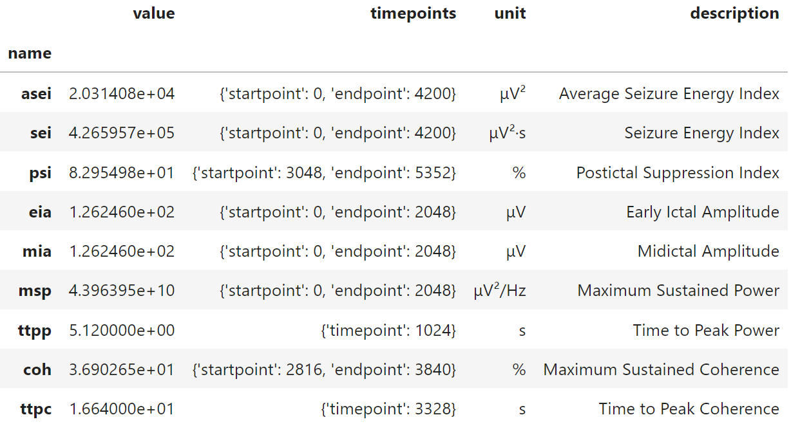

# ECTMetrics

ECTMetrics is a Python library for analyzing EEG signals, particularly focusing on electroconvulsive therapy (ECT) seizure metrics. It provides functionalities to generate synthetic EEG signals, visualize them, and calculate various metrics related to seizure activity.

## Features

- Generate synthetic ECT specific EEG signals with customizable parameters.
- Visualize EEG signals for better understanding and analysis.
- Import EEG data from <a href="https://www.genet-ect.org/" target="_blank" style="text-decoration: none;">GPD</a> <a href="https://github.com/elektrika-inc/GPD-wiki" target="_blank" style="text-decoration: none;">(Elektrika Inc®)</a>.


- Calculate various ECT seizure metrics, including:
  - **Average Seizure Energy Index (ASEI)**
  - **Seizure Energy Index (SEI)**
  - **Postictal Suppression Index (PSI)**
  - **Earlyictal Amplitude (EIA)**
  - **Midictal Amplitude (MIA)**
  - **Maximum Sustained Power (MSP)**
  - **Time to Peak Power (TTPP)**
  - **Maximum Sustained Coherence (COH)**
  - **Time to Peak Coherence (TTPC)**
  
  
## Installation

To install the `ectmetrics` library, clone the repository and use pip to install the library and it's dependencies:

```bash
git clone https://github.com/maxkayser/ectmetrics
cd ectmetrics
pip install .
```

## Usage

### Usage examples
This section lists various usage examples for the `ectmetrics` library as demonstrated in Jupyter Notebook.
- <a href="examples/example_simple.ipynb" target="_blank" alt="Simple usage example">Simple usage example</a>
- <a href="examples/example_eeg_signal_generation.ipynb" target="_blank" alt="EEG signal generatio">EEG signal generation</a>
- <a href="examples/example_eeg_signal_import.ipynb" target="_blank" alt="EEG signal import">EEG signal import</a>
- <a href="examples/example_ect_metrics_calculation.ipynb" target="_blank" alt="ECT seizure quality metrics calculation">ECT seizure quality metrics calculation</a>

### Quick start
Here’s a short example of generating an EEG signal and calculating the ECT seizure metrics.

```python
# Import the ectmetrics library and it's modules
import ectmetrics
from ectmetrics.eeg import generate, plot
from ectmetrics.metrics import calculate_metrics

# Generate a synthetic EEG signal
eeg_data = generate(
    signal_duration=28,      # in seconds
    seizure_duration=21,     # in seconds
    sampling_frequency=200,  # in Hz
    eeg_name='My EEG'
)

# Calculate the ECT seizure quality metrics
metrics_results = calculate_metrics(eeg_data)

metrics_results
```



## Contact Information

For more details, please refer to the [contact information](CONTACT.md) file.


## Citing ECTMetrics

For citation information, please refer to the [citations](CITATIONS.md) file.

## Acknowledgements

The authors sincerely acknowledge the access granted to the [Bonna computing cluster](https://www.hpc.uni-bonn.de/en) hosted by the [University of Bonn](https://www.uni-bonn.de/en) and the support provided by its High-Performance Computing & Analytics Lab. We extend special thanks to Ralf Berninger for his invaluable technical insights and assistance regarding the Thymatron® System IV stimulation device. We also express our deep gratitude to Jesse Pavel for the development and ongoing enhancement of the ECT data collection tool, [GPD](https://github.com/elektrika-inc/GPD-wiki).

All acknowledgments are associated with research that was partially funded by the [BONFOR](https://www.medfak.uni-bonn.de/de/forschung/forschungsfoerderung/bonfor/bonfor-forschungsfoerderprogramm) and the FKS study support program [2021-FKS-12] of the [University Hospital Bonn](https://www.ukbonn.de/). This research did not receive any additional grants from funding agencies in the public, commercial, or not-for-profit sectors.

## Running Tests

To run the tests, you will need pytest. Install it via pip if you haven’t already:

```bash
pip install pytest
```
Then run the tests with:

```bash
pytest tests/
```
