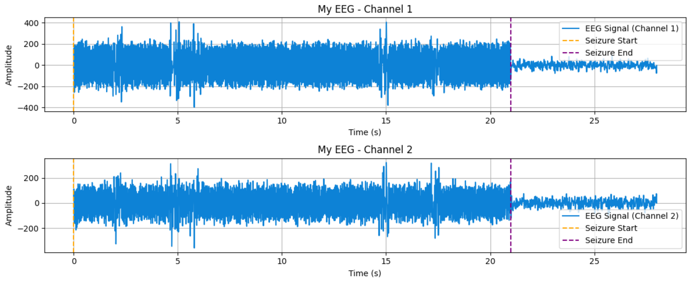

# ECTMetrics

ECTMetrics is a Python library for analyzing EEG signals, particularly focusing on electroconvulsive therapy (ECT) seizure metrics. It provides functionalities to generate synthetic EEG signals, visualize them, and calculate various metrics related to seizure activity.

## Features

- Generate synthetic ECT specific EEG signals with customizable parameters.
- Visualize EEG signals for better understanding and analysis.
- Import EEG data from <a href="https://www.genet-ect.org/" target="_blank" style="text-decoration: none;">GPD</a> <a href="https://github.com/elektrika-inc/GPD-wiki" target="_blank" style="text-decoration: none;">(Elektrika Inc®)</a>.


- Calculate various ECT seizure metrics, including:
  - **Average Seizure Energy Index (ASEI)**
  - **Seizure Energy Index (SEI)**
  - **Postictal Suppression Index (PSI)**
  - **Earlyictal Amplitude (EIA)**
  - **Midictal Amplitude (MIA)**
  - **Maximum Sustained Power (MSP)**
  - **Time to Peak Power (TTPP)**
  - **Maximum Sustained Coherence (COH)**
  - **Time to Peak Coherence (TTPC)**
  
  
## Installation

To install the `ectmetrics` library, clone the repository and use pip to install the dependencies:

```bash
git clone https://github.com/maxkayser/ectmetrics
cd ectmetrics
pip install .
```

## Usage example

First, import the `ectmetrics` library.

```python
import ectmetrics
```

You can now generate a synthetic EEG signal by calling the `generate()` function and specifying its parameters.

```python
from ectmetrics.eeg import generate, plot

# Generate the EEG signal
eeg = generate(
    signal_duration = 28,      # Duration of the EEG signal in seconds
    seizure_duration = 21,     # Duration of the seizure in seconds
    sampling_frequency = 200,  # Sampling frequency of the signal in Hz
    eeg_name = 'My EEG'        # Name or identifier for the EEG
)
```
Alternatively, you can import an EEG signal from an EDF or <a href="https://www.edfplus.info/" target="_blank" style="text-decoration: none;">EDF+</a> file (i.e. from GPD).

```python
from ectmetrics.eeg import import_eeg

# Import the EEG data
eeg = import_eeg(file_path, name='My EEG')
```

Let's visualize the EEG

```python
#Visualize the EEG signals
plot(eeg)
```




Now use the `metrics()` function in order to calculate the seizure quality metrics

```python
from ectmetrics.metrics import metrics

# Calculate the ECT seizure quality metrics
metrics = metrics(eeg)
```

For easier visualization of the results, represent the output as a DataFrame using the `pandas` library.

```python
import pandas as pd
df_metrics = pd.DataFrame(metrics).set_index('name')
df_metrics
```


## Complete workflow example
Here’s a complete example of generating an EEG signal and calculating the seizure metrics.

```python
import ectmetrics
from ectmetrics.eeg import generate, plot
from ectmetrics.metrics import calculate_metrics

eeg = generate(
    signal_duration=28,
    seizure_duration=21,
    sampling_frequency=200,
    eeg_name='My EEG'
)

metrics = calculate_metrics(eeg)

metrics
```


## Running Tests

To run the tests, you will need pytest. Install it via pip if you haven’t already:

```bash
pip install pytest
```
Then run the tests with:

```bash
pytest tests/
```
